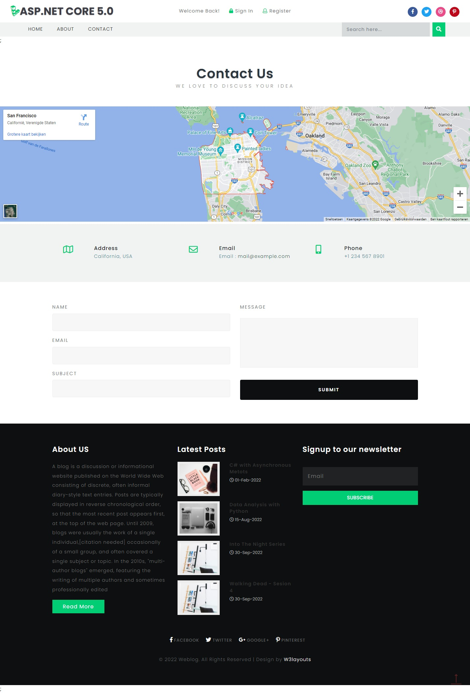
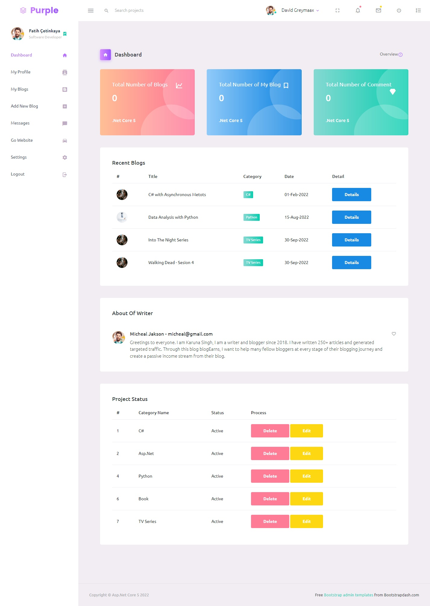
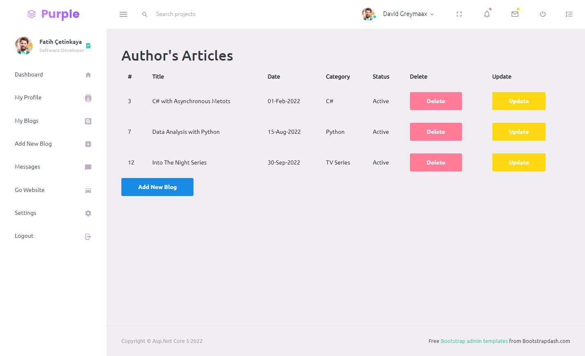
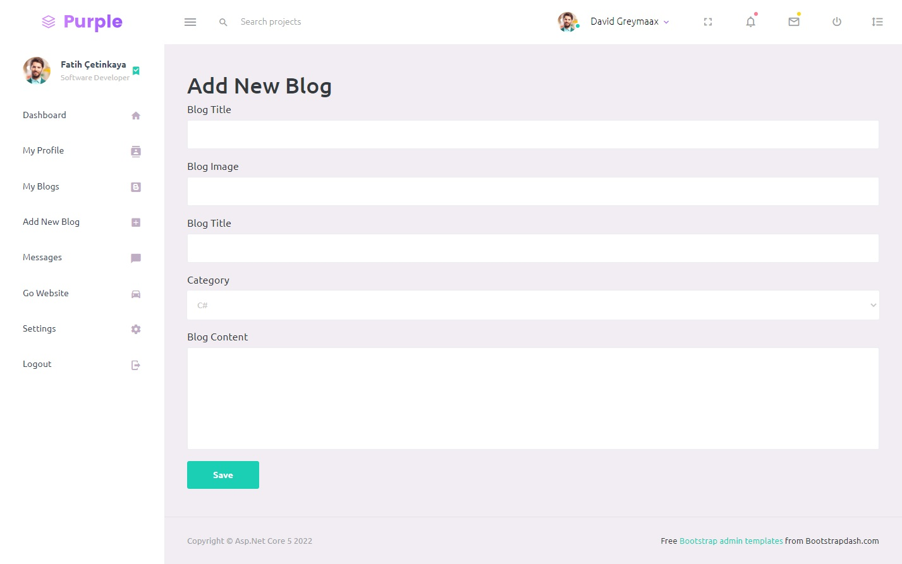

# Asp.Net Core 5 - Blog Project
Asp.Net Core 5 - Blog Project (Generic Repository and Unit Of Work Pattern)

## Table of contents
* [General info](#general-info)
* [Screenshots](#screenshots)
* [Projects](#Projects)
* [Code Examples](#code-examples)

## General info
I have prepared a project for those who want to get started with Asp.Net Core 5 MVC and for beginners. You can find the codes and sample pages of this project on github.
In examples it is used in SQL Server database.

## Screenshots








## Projects
- N Tier Arc.
	- Entity Layer
	- Data Access Layer
	- Business Layer
	- Presentation Layer
	- Core Layer
	- Api
- Generic Repository Pattern
- Unit Of Work Pattern
- FluentValidation
- SweetAlert
- Authorize
- Authentication

## Code Examples
Show examples of usage:
```
    public class GenericRepository<T> : IGenericDal<T> where T : class
    {      
        public void Insert(T t)
        {
            using var c = new Context();
            c.Add(t);
            c.SaveChanges();
        }

        public void Update(T t)
        {
            using var c = new Context();
            c.Update(t);
            c.SaveChanges();
        }

        public void Delete(T t)
        {
            using var c = new Context();
            c.Remove(t);
            c.SaveChanges();
        }

        public T GetByID(int id)
        {
            using var c = new Context();
            return c.Set<T>().Find(id);
        }

        public List<T> GetListAll()
        {
            using var c = new Context();
            return c.Set<T>().ToList();
        }

        public List<T> GetListAll(Expression<Func<T, bool>> filter)
        {
            using var c = new Context();
            return c.Set<T>().Where(filter).ToList();
        }
    }

```
